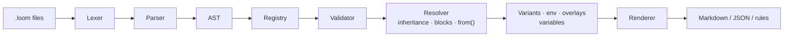
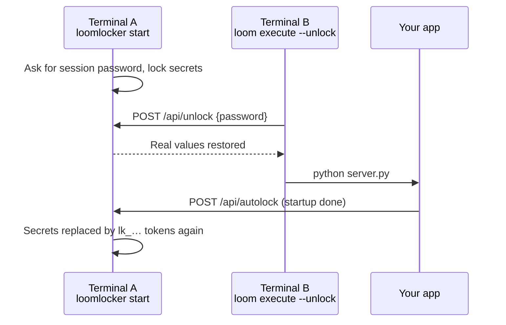

<div align="center">

# PromptLoom

**Treat prompts like source code.**

Inheritance · Composition · Validation · Rendering · Testing · Packaging

`loom` — a developer-first CLI for writing, resolving, and shipping AI prompts.


</div>

---

## Table of Contents

1. [Why PromptLoom?](#1-why-promptloom)
2. [Feature Overview](#2-feature-overview)
3. [Quick Start](#3-quick-start)
4. [Core Concepts](#4-core-concepts)
5. [The Loom Language](#5-the-loom-language)
6. [Project Layout & Configuration](#6-project-layout--configuration)
7. [CLI Reference](#7-cli-reference)
8. [Rendering Pipeline](#8-rendering-pipeline)
9. [Prompt Packs & the Registry](#9-prompt-packs--the-registry)
10. [LoomLocker — Session-Scoped Secret Protection](#10-loomlocker--session-scoped-secret-protection)
11. [Editor Support](#11-editor-support)
12. [Repository Structure](#12-repository-structure)
13. [Architecture](#13-architecture)
14. [Development](#14-development)
15. [Documentation Map](#15-documentation-map)
16. [Roadmap](#16-roadmap)
17. [License](#17-license)

---

## 1. Why PromptLoom?

Real-world prompts grow into long, copy-pasted walls of text. They drift between projects, nobody knows which version is deployed, and a small wording change can silently break behaviour.

PromptLoom applies the tools developers already trust to prompts:

| Software practice | PromptLoom equivalent |
|---|---|
| Classes & inheritance | `prompt Child inherits Parent { … }` |
| Mixins / traits | `block` + `use BlockName` |
| Compiler | `loom weave` resolves everything into one Markdown/JSON artifact |
| Linter / type checker | `loom inspect`, `loom doctor`, `loom smells` |
| Lockfile | `loom lock` / `loom check-lock` |
| `git blame` / changelog | `loom blame`, `loom changelog` |
| Package manager | `loom install`, `loom publish`, `.dependency.loom` |
| Unit tests | `loom test`, `loom check-output` (contracts) |
| CI gates | `loom ci` |

You write small, focused `.loom` files. PromptLoom parses, validates, resolves, and renders them into the final prompt your model sees.

---

## 2. Feature Overview

**Authoring**
- Declarative DSL with named fields (`persona`, `objective`, `instructions`, `constraints`, …)
- Single and **multiple inheritance** with an explicit `from(parent[…])` merge language
- Reusable **blocks**, render-time **overlays**, **variants**, and per-environment **env** blocks
- Template variables (`var`), required inputs (`slot`), and **secret slots** that never render

**Quality & safety**
- `loom inspect` — errors: undefined refs, cycles, duplicates, unknown fields, type errors
- `loom doctor` / `loom smells` — heuristics such as *God Prompt*, *Constraint Pile-Up*, *Conflicting Instructions*
- `loom audit` — scans for dangerous instructions and security risks
- **Contracts** and **capabilities** declared in the prompt and enforceable on model output

**Output**
- Render to Markdown, Anthropic JSON, OpenAI JSON, Cursor rules, Copilot instructions, Claude Code files, or plain text
- Copy to clipboard, cast to a destination, or deploy to configured targets
- Source maps and stable fingerprints for traceability

**Workflow**
- Interactive REPL, guided weave wizard, and a live **playground**
- Dependency **graph** browser, token **stats**, semantic **diff**, PR-friendly **review**
- `loom start` — LLM-assisted (or template-based) starter library generated from your repo
- `loom test` — smoke-test prompts against a real model (Gemini / Anthropic)

**Ecosystem**
- **Packs** — distributable prompt bundles, with a registry server and `loom install` / `loom publish`
- **LoomLocker** — hides real secrets from AI agents during a work session
- **Lumine** — VS Code extension with a full language server; `loom lsp` for other editors
- Language client libraries: **bloompy** (Python), **gloom** (Go), **loomj** (Java)

---

## 3. Quick Start

### Prerequisites

- Go **1.25+**
- Optional: an API key for `loom test`, `loom start`, and `loom summarize` (Gemini by default)

### Install

**Download a release** (macOS, Linux, Windows; amd64 and arm64) from the
[Releases page](https://github.com/sayandeep14/PromptLoom/releases), unpack it, and put `loom`
(and optionally `loomlocker`) on your `PATH`. Check the download with `checksums.txt`, then:

```bash
loom --version
```

**Or install from source** (tracks the latest commit on `main`, not a tagged release):

```bash
go install github.com/sayandeep14/PromptLoom/cmd/loom@latest
```

**Or build a checkout yourself:**

```bash
git clone https://github.com/sayandeep14/PromptLoom.git
cd PromptLoom
go install ./cmd/loom          # places `loom` in ~/go/bin
export PATH="$PATH:$HOME/go/bin"
```

Or just build in place:

```bash
make build        # binary in ./bin/loom, version stamped from git
```

### Your first prompt in 60 seconds

```bash
mkdir my-prompts && cd my-prompts
loom init --sample            # scaffold workspace + example prompts
loom list                     # see what exists
loom inspect                  # validate everything
loom weave GoCodeReviewer     # render to loom/dist/…
loom weave GoCodeReviewer --stdout
```

Or scaffold your own:

```bash
loom thread prompt Greeter    # creates Greeter.prompt.loom
```

```text
prompt Greeter {
  persona :=
    You are a friendly assistant.

  objective :=
    Help the user with their request clearly and concisely.
}
```

Running `loom` with **no arguments** opens the interactive REPL with tab completion for commands and prompt names.

---

## 4. Core Concepts

| Concept | File | What it is |
|---|---|---|
| **Prompt** | `*.prompt.loom` | A full prompt made of fields; may inherit from other prompts |
| **Block** | `*.block.loom` | A reusable set of rules mixed in with `use` — not a complete prompt |
| **Overlay** | `*.overlay.loom` | A modifier applied at render time (`--overlay terse`) |
| **Vars file** | `*.vars.loom` | Shared variable definitions |
| **Variant** | inside a prompt | Named field overrides activated with `--variant` |
| **Env block** | inside a prompt | Overrides applied with `--env prod` |
| **Pack** | directory | A distributable bundle of prompts, blocks, and overlays with metadata |

**Resolution order** for a single prompt:

```
parents (left → right)  →  blocks (in `use` order)  →  the prompt's own fields
                        →  variant  →  env  →  overlays  →  variable substitution
```

---

## 5. The Loom Language

> Full reference: [`docs/LOOM_LANGUAGE.md`](docs/LOOM_LANGUAGE.md)

### 5.1 Fields

| Field | Kind | Purpose |
|---|---|---|
| `summary` | scalar | One-line description (shown by `loom list`) |
| `persona` | scalar | Who the model is |
| `context` | scalar | The situation it operates in |
| `objective` | scalar | The primary goal |
| `notes` | scalar | Author notes |
| `instructions` | list | Ordered steps |
| `constraints` | list | Hard rules |
| `examples` | list | Input/output examples |
| `format` | list | Response structure |

Scalars are indented text; lists are `- ` items. The **only** field operator is `:=` (the older `+=` / `-=` operators were removed in v2 — use `from()` instead).

### 5.2 Inheritance

```text
prompt CodeReviewer inherits BaseEngineer {
  objective :=
    Review the submitted code for correctness and idiomatic style.

  instructions :=
    from(parent[0]) and {
      - Check for unchecked errors.
      - Suggest table-driven tests.
    }
}
```

Multiple parents are supported. If two parents define the same field and the child does not, **the first parent wins** and a warning is recorded:

```text
prompt FullStackReviewer inherits BackendReviewer, FrontendReviewer { … }
```

Cross-pack references use a slug prefix: `inherits go-backend.GoCodeReviewer`.

### 5.3 The `from()` expression language

| Expression | Meaning |
|---|---|
| `from(parent[*])` | All items from all parents (list fields; duplicates removed) |
| `from(parent[0])` | The value from the first parent |
| `from(parent[0]) and from(parent[1])` | Concatenate selected parents |
| `parent[0].instructions[1..4]` | Items 1–3 of a parent's list (0-based, exclusive end) |
| `from(go-backend.BaseGoEngineer)` | A specific named parent |
| `expr and { - new item }` | Append literal items |

Type rules are checked: `from(parent[*])` on a scalar field is an error, since `[*]` produces a vector.

### 5.4 Blocks

```text
block GoConventions {
  constraints :=
    - Follow gofmt / goimports formatting.
    - Return errors as the last return value.
}

prompt GoCodeReviewer inherits BaseGoEngineer {
  use GoConventions
}
```

### 5.5 Variables, slots, and secrets

```text
prompt RepoReviewer {
  var  language = "Go"                       # optional, has a default
  slot repo_name { required: true }          # must be supplied
  slot api_key   { secret: true }            # never rendered as plain text

  context :=
    You are reviewing {{ repo_name }} written in {{ language }}.
}
```

```bash
loom weave RepoReviewer --set repo_name=payments --set language=Rust
```

### 5.6 Variants, env blocks, overlays

```text
prompt CodeAssistant inherits BaseEngineer {
  variant strict {
    constraints :=
      - Every suggestion must include tests.
  }

  env prod {
    constraints :=
      from(parent[0]) and {
        - All external calls must use timeouts.
      }
  }
}
```

```bash
loom weave CodeAssistant --variant strict --env prod --overlay terse
```

### 5.7 Contracts and capabilities

```text
contract {
  required_sections:
    - Summary
    - Action Items
  must_not_include:
    - "As an AI"
}

capabilities {
  allowed:   [read_code, suggest_changes]
  forbidden: [delete_files, access_secrets]
}
```

Validate a real model response against the contract:

```bash
loom check-output SummaryWriter response.txt
```

### 5.8 Additional metadata fields

`todo:`, `kind:`, `compatible_with:`, and `tags:` help with maintenance tooling (`loom todos`, `loom stale`, `loom minimize`).

---

## 6. Project Layout & Configuration

`loom init` creates this workspace:

```text
your-project/
├── loom.toml                 # PromptLoom project config
├── .gitignore                # updated automatically
└── loom/
    ├── src/
    │   ├── prompts/          # *.prompt.loom
    │   ├── blocks/           # *.block.loom
    │   ├── overlays/         # *.overlay.loom
    │   ├── .export.loom      # which prompts are public API
    │   └── .dependency.loom  # pack dependencies
    ├── loompack/             # installed packs (loom install)
    ├── context/
    │   ├── REPO.md           # architecture notes for `loom start`
    │   ├── TODO.md           # current tasks
    │   └── docs/
    ├── dist/                 # rendered output (written by `loom weave`)
    ├── .loom.env
    ├── .loom.config          # LoomLocker + custom commands (gitignored)
    └── .loom.secret          # API keys (gitignored, mode 0600)
```

### `loom.toml`

```toml
[project]
name    = "my-project"
version = "0.1.0"

[paths]
prompts  = "loom/src/prompts"
blocks   = "loom/src/blocks"
overlays = "loom/src/overlays"
out      = "loom/dist"

[render]
default_format      = "markdown"
include_metadata    = false
include_sourcemap   = false
include_fingerprint = false

[validation]
require_objective        = true
require_format           = true
require_contract         = false
warn_on_empty_context    = true
warn_on_deep_inheritance = true
max_inheritance_depth    = 3
smell_constraint_limit   = 25
token_limit_warn         = 0          # 0 = off

[testing]
provider      = "gemini"              # "gemini", "anthropic" or "openai"
api_key_env   = "GEMINI_API_KEY"      # optional: defaults to the provider's own variable
default_model = "gemini-2.5-flash"    # optional: defaults to the provider's own model
timeout_sec   = 30
```

`provider = "anthropic"` alone is enough: the key is then read from `ANTHROPIC_API_KEY` and the model defaults to a Claude model (`OPENAI_API_KEY` / `gpt-4o-mini` for OpenAI). Every feature that calls a model (`loom test`, `loom summarize`, `loom start`) goes through one client that sends the key in a header, never in a URL, and keeps it out of error messages.

Also supported: `[profile.<name>]` (named variable sets, used with `--profile`) and `[[targets]]` (prompt → format → destination, used by `loom deploy`).

### API keys

Keys live in `loom/.loom.secret` (or `.loomsecret`) and are loaded automatically. **Never commit this file** — `loom init` gitignores it.

---

## 7. CLI Reference

> Every flag and example: [`docs/LOOM_COMMAND.md`](docs/LOOM_COMMAND.md)

### Setup & scaffolding

| Command | Purpose |
|---|---|
| `loom init [--sample]` | Create the workspace and `loom.toml` |
| `loom start [--nollm] [--minimal] [--best] [--stack X]` | Generate a starter library from `CLAUDE.md` / `TODO.md` (LLM or built-in templates) |
| `loom thread prompt\|block\|overlay\|vars <Name>` | Scaffold a new source file |
| `loom recipe list` / `loom recipe apply <name>` | Built-in templates: `reviewer`, `api-designer`, `migration-assistant`, `security-auditor`, `docs-writer` |
| `loom import [file.md]` | Convert an existing Markdown prompt into Loom DSL |

### Rendering

| Command | Purpose |
|---|---|
| `loom weave <Name>` | Render one prompt |
| `loom weave --all [--incremental] [--watch]` | Render everything; skip unchanged; rebuild on change |
| `loom weave --interactive` | Guided assembly wizard |
| `loom copy <Name>` | Render to the clipboard |
| `loom cast <Name>` | Render and send to a named destination |
| `loom deploy` | Write all configured `[[targets]]` |
| `loom playground <Name>` | Live preview with variant/format/overlay controls |

Useful `weave` flags: `--format`, `--variant`, `--env`, `--overlay`, `--set key=value`, `--vars file.toml`, `--profile`, `--with file:path|dir:path|git:diff|git:staged|stdin`, `--context`, `--sourcemap`, `--stdout`, `--out`.

**Render formats:** `markdown`, `json-anthropic`, `json-openai`, `cursor-rule`, `copilot`, `claude-code`, `plain`.

### Inspection & understanding

| Command | Purpose |
|---|---|
| `loom list` | All prompts and blocks |
| `loom inspect` | Validate the whole library (errors + warnings) |
| `loom trace <Name>` | Inheritance chain and per-field source |
| `loom unravel <Name>` | Fully expanded prompt, pre-render |
| `loom graph [Name]` | Dependency graph (interactive browser) |
| `loom stats [Name]` | Per-field token estimates |
| `loom contract <Name>` | Show contract and capabilities |
| `loom fingerprint <Name>` | Stable hash of the resolved prompt |

### Quality & safety

| Command | Purpose |
|---|---|
| `loom doctor [Name]` | Health check |
| `loom smells [Name]` | Heuristic smells (God Prompt, Persona Soup, Format Drift, …) |
| `loom audit [Name]` | Security scan of instructions |
| `loom minimize` | Detect and remove redundant content |
| `loom stale` | Version mentions that no longer match dependency files |
| `loom todos` | Collect all `todo:` items |
| `loom fmt` | Canonical formatting |

### Testing, history & CI

| Command | Purpose |
|---|---|
| `loom test [Name] [--all] [--model M] [--record] [--compare]` | Smoke-test against a real model, assert contract |
| `loom check-output <Name> <file>` | Validate a model output against a contract |
| `loom diff [A] [B]` | Field-aware diff between prompts or against `dist` |
| `loom review` | PR-friendly diff summary |
| `loom blame <Name>` / `loom changelog [Name]` | Git attribution per field item; prompt-centric change log |
| `loom journal add\|list` | Library change journal |
| `loom lock` / `loom check-lock` | Write / verify `loom.lock` fingerprints |
| `loom ci` | Run inspect + doctor + check-lock + diff as one gate |

### Packs, integrations & misc

| Command | Purpose |
|---|---|
| `loom install <pack>` | Download a pack **and its dependencies**, then compile |
| `loom publish <dir> [--dry-run]` | Upload a pack to the registry |
| `loom pack init\|build\|install\|list\|remove` | Local `.lpack` archive workflow |
| `loom mcp manifest [Name]` | Generate an MCP tool manifest |
| `loom lsp` | Language Server Protocol server |
| `loom summarize <workspace \| path…>` | LLM-powered project or file summary |
| `loom execute <cmd> [--unlock]` | Run a custom command from `.loom.config` (see LoomLocker) |

### Exit codes and CI

`inspect`, `check-lock`, and `ci` exit non-zero on failure. A minimal GitHub Actions step:

```yaml
- run: go install ./cmd/loom
- run: loom ci
```

---

## 8. Rendering Pipeline



Every stage has its own package under `internal/`, so each is unit-testable in isolation.

### Example output

```markdown
# GoCodeReviewer

## Summary
Conducts thorough, constructive Go code reviews.

## Persona
You are a principal Go engineer conducting a thorough code review.

## Objective
Review the submitted Go code and provide actionable feedback…

## Instructions
- Read the full context before responding.
- Check for unchecked errors and silent failures.

## Constraints
- Follow standard Go formatting (gofmt / goimports).

## Output Format
- Summary
- Issues Found
- Recommendations
- Verdict
```

---

## 9. Prompt Packs & the Registry

A **pack** is a distributable directory of prompts, blocks, and overlays:

```text
my-pack/
├── prompts/      *.prompt.loom
├── blocks/       *.block.loom
├── overlays/     *.overlay.loom
├── .metadata.loom     # id (UUID), slug, version, name, author, description, tags
├── .dependency.loom   # other packs this one needs
├── .export.loom       # which names are public
└── loom.toml
```

**`.dependency.loom`** looks like a `requirements.txt`:

```text
go-foundation>=1.0.0
testing-utils==2.3.0
shared-rules~=1.4.0
webdev==0.0.1 as dev        # alias
```

Operators: `==`, `>=`, `>`, `<=`, `<`, `~=`.

**Namespaces.** Inside a pack, use bare names. Across packs use `slug.Name` (`use go-backend.GoConventions`, `--overlay go-backend.terse`).

### Installing

```bash
loom install go-backend
```

```text
loom/loompack/go-backend/
├── source/       raw .loom files
├── compiled/     one rendered .md per prompt
└── pack.json     metadata + install timestamp
```

PromptLoom has **no built-in default registry** — run your own (below) or use one your team provides, and point `loom` at it with any of:

```bash
loom install go-backend --registry https://registry.example.com   # one-off
export LOOM_REGISTRY_URL=https://registry.example.com             # shell
echo 'LOOM_REGISTRY_URL=https://registry.example.com' >> loom/.loom.env   # project
```

```toml
# loom.toml
[registry]
url = "https://registry.example.com"
```

Precedence: `--registry` → `$LOOM_REGISTRY_URL` → `loom/.loom.env` → `loom.toml`. With no registry configured, `loom install` and `loom publish` print these instructions. `loom publish` refuses to send the upload secret over plain `http://` to anything but `localhost`.

### Publishing

```bash
loom publish ./my-pack --dry-run
loom publish ./my-pack --secret "$UPLOAD_SECRET"
```

### Registry server (`server/`)

A small Go service backed by PostgreSQL. Self-hosting is one command:

```bash
cd server
cp .env.example .env        # set POSTGRES_PASSWORD and UPLOAD_SECRET
docker compose up -d --build
loom publish ./my-pack --registry http://localhost:8080 --secret "$UPLOAD_SECRET"
```

Highlights: writes fail closed without `UPLOAD_SECRET`, per-IP rate limits, strict upload validation, non-root read-only container, self-applying schema. Configuration, TLS, backups, upgrades and the API are documented in [`server/README.md`](server/README.md).

---

## 10. LoomLocker — Session-Scoped Secret Protection

AI agents sometimes need to read config files (`.env`, `application.yaml`) that contain secrets. **LoomLocker** is a separate binary that swaps real values for random tokens (`lk_7f3a9b2c1d4e5a6b`) while your agent works, keeping keys and file structure intact — and restores the real values only for the brief moment your app starts.



### Configure (`.loom.config`)

```json
{
  "secret": [".loom.secret", ".env:{API_KEY}", "application.yaml:{kafka.consumer-id}"],
  "loomlocker": {
    "active": true,
    "lockhost": "http://localhost",
    "port": "8053",
    "recoverable": false,
    "unlock_duration_seconds": 10
  },
  "custom": {
    "runproject": "python server.py",
    "testproject": "pytest"
  }
}
```

| Secret entry | Locks |
|---|---|
| `".loom.secret"` | Every `KEY=VALUE` in the file |
| `".env:{API_KEY}"` | One key in a dotenv file |
| `"application.yaml:{kafka.consumer-id}"` | A dotted YAML path |

### Use

```bash
# Terminal A
cd loomlocker && go build -o ~/.local/bin/loomlocker ./cmd/loomlocker
loomlocker start                     # password prompt, then server + REPL (lock / unlock / status / stop)

# Terminal B
loom execute runproject --unlock     # unlock → run → server auto-relocks
loom execute testproject             # runs normally
```

If the server isn't running (or is already unlocked), `--unlock` is ignored and the command runs as usual.

### Security model

- The session password is verified with **bcrypt** and is never written to disk.
- **Non-recoverable mode** (default): the AES key and the token→value map exist only in process memory. If the process dies while locked, restore from version control.
- **Recoverable mode**: the mapping is encrypted with **AES-256-GCM**, keyed via **Argon2id**, and stored in `.loom.secret.lock`; `loomlocker recover` restores it.
- Locking needs no password; unlocking always does.

### Client libraries

For apps that load secrets themselves, unlock only around the loading code:

```python
# Python — bloompy
from bloompy import Safe
Safe().unlock().execute(load_dotenv).autolock()
```

```go
// Go — gloom
gloom.NewSafe().Unlock().Execute(func() { godotenv.Load() }).Autolock()
```

```java
// Java — loomj
new Safe().unlock().execute(() -> Dotenv.load()).autolock();
```

Each library finds `.loom.config` by walking up the tree, honours `LOOM_HOST` / `LOOM_PORT`, reads the password from `LOOM_SESSION_PASSWORD`, and is a no-op when LoomLocker isn't running. See `libs/*/README.md`.

Full design: [`loomlocker/DESIGN.md`](loomlocker/DESIGN.md).

---

## 11. Editor Support

### Lumine — VS Code extension (`Lumine/`)

- Syntax highlighting and file icons for `.prompt.loom`, `.block.loom`, `.overlay.loom`, `.vars.loom`, `loom.toml`
- Live diagnostics: unknown parents/blocks, cycles, bad fields, duplicates, undefined `{{ variables }}`, plus configurable warnings
- Completions, hover docs, Go to Definition, Find References, Outline view
- Formatter matching `loom fmt`
- Snippets (`prompt`, `prompti`, `block`, `overlay`, `use`, `var`, `slot`, `variant`, `contract`, …)
- Palette commands: **Loom: Weave**, **Loom: Inspect**, **Loom: Open Dependency Graph**

```bash
cd Lumine && npm install && node build.js
npx vsce package         # produces lumine-<version>.vsix
```

### Other editors

`loom lsp` starts a Language Server over stdio. A Neovim setup is documented in [`docs/neovim-lsp.md`](docs/neovim-lsp.md).

---

## 12. Repository Structure

```text
PromptLoom/
├── cmd/loom/                  # CLI entry point
├── internal/
│   ├── ast/  lexer/  parser/  # DSL front end
│   ├── registry/  validate/   # name table + checks
│   ├── resolve/  render/      # inheritance, from(), output formats
│   ├── cli/                   # one file per Cobra command
│   ├── tui/                   # Bubble Tea REPL, playground, pickers, graph view
│   ├── config/  loader/  workspace/  secret/
│   ├── deps/  installer/  pack/  packmetadata/  namespacereg/  lockerclient/
│   ├── doctor/  audit/  minimize/  stale/  tokens/  semantic/
│   ├── diff/  blame/  journal/  fingerprint/  lock/  sourcemap/
│   ├── contract/  testrunner/  mcp/  lsp/  importer/  format/
│   └── starter/  summarize/  recipe/  context/  export/  vars/  graph/
├── server/                    # Registry HTTP service (Go + PostgreSQL)
├── loomlocker/                # Secret-locking binary (separate Go module)
├── libs/
│   ├── bloompy/               # Python client
│   ├── gloom/                 # Go client
│   └── loomj/                 # Java client
├── Lumine/                    # VS Code extension (TypeScript)
├── examples/                  # Sample packs
├── docs/                      # Language and command reference
└── TRACKER.md                 # Work tracker: roadmap, tickets, dependencies
```

---

## 13. Architecture

**Language & libraries.** Go 1.25, [Cobra](https://github.com/spf13/cobra) for commands, [BubbleTea / Bubbles / Lip Gloss](https://github.com/charmbracelet) for the terminal UI, [BurntSushi/toml](https://github.com/BurntSushi/toml) for config, [fsnotify](https://github.com/fsnotify/fsnotify) for `--watch`.

**Design principles**

- **Source of truth is text.** Everything is a plain file that diffs cleanly in Git.
- **Resolve, then render.** Inheritance and composition are fully resolved into one model before any output format is produced, so every format is consistent.
- **Errors teach.** Diagnostics follow a Rust-compiler style: what went wrong, which file and line, and how to fix it.
- **Deterministic.** Fingerprints and lockfiles make prompt drift detectable in CI.
- **Secrets stay out.** Secret slots are redacted from output, and LoomLocker keeps real values away from agents.

**Modules**

| Module | Path | Go module |
|---|---|---|
| CLI | `/` | `github.com/sayandeep14/PromptLoom` |
| Registry | `server/` | `github.com/sayandeep14/PromptLoom/server` |
| LoomLocker | `loomlocker/` | separate `go.mod` |
| gloom | `libs/gloom/` | separate `go.mod` |

---

## 14. Development

```bash
make build                   # build the CLI into ./bin/loom
go test ./...                # run all tests
go test ./internal/parser/...  # a single package
go test ./internal/e2e -update # regenerate golden files after an intentional output change
go vet ./...                 # static checks
```

Packages with unit tests include `parser`, `resolve` (including multi-parent), `validate`, `render`, `format`, `graph`, `deps`, `installer`, `sourcemap`, and `tui`. `internal/e2e` runs the whole pipeline (and the built binary) over the fixture projects in `testdata/` — see [`testdata/README.txt`](testdata/README.txt).

### Registry integration tests

The registry's PostgreSQL tests are skipped unless `TEST_DATABASE_URL` is set — see [`server/README.md`](server/README.md#tests).

### Contributing

1. Fork and create a feature branch.
2. Add or update tests alongside your change.
3. Run `go vet ./... && go test ./...`.
4. Update the relevant file in `docs/` when you add or change a command.
5. Open a pull request describing the *why*.

---

## 15. Documentation Map

| Document | What's inside |
|---|---|
| [`docs/LOOM_LANGUAGE.md`](docs/LOOM_LANGUAGE.md) | Complete DSL reference — fields, inheritance, `from()`, packs, contracts |
| [`docs/LOOM_COMMAND.md`](docs/LOOM_COMMAND.md) | Every CLI command with flags and examples |
| [`docs/neovim-lsp.md`](docs/neovim-lsp.md) | Neovim LSP configuration |
| [`server/README.md`](server/README.md) | Running the registry: Docker, TLS, backups, API |
| [`loomlocker/DESIGN.md`](loomlocker/DESIGN.md) | LoomLocker architecture, crypto, and HTTP API |
| [`Lumine/README.md`](Lumine/README.md) | VS Code extension features |
| [`TRACKER.md`](TRACKER.md) | What is done, what is next, and what depends on what |

---

## 16. Roadmap

The live roadmap, with tickets and dependencies, is in [`TRACKER.md`](TRACKER.md). Headline items: registry hardening, a full test net, Lumine v2 support, a first tagged release, then `impact` / `sync` / `eval` and an agentic run mode.

---

## 17. License

Released under the **MIT License** — see [`LICENSE`](LICENSE).

---

<div align="center">

Built by [Sayandeep Giri](https://github.com/sayandeep14) · *Write prompts once. Weave them everywhere.*

</div>
