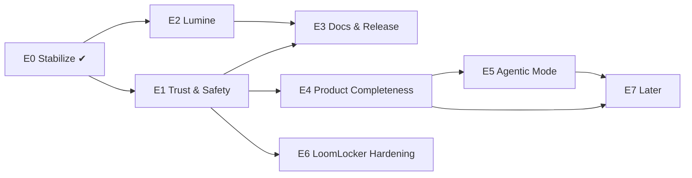

# PromptLoom — Work Tracker

The single source of truth for what is done, what is next, and what blocks what.
Keep it current: update a ticket's status in the same commit that does the work.

**Last updated:** 2026-09-21 · **Current version:** 4.2.0 · **Active epic:** E1 — Trust & Safety (E1 core done; E2 done — Lumine ships as a VSIX from GitHub Releases)

---

## How to use this file

**Status:** `TODO` · `IN PROGRESS` · `BLOCKED` · `DONE` · `DROPPED`
**Priority:** `P0` blocker for a public release · `P1` important · `P2` nice to have
**Size:** `S` ≤ half a day · `M` 1–2 days · `L` 3–5 days · `XL` > 1 week

Each ticket: `ID · title · status · priority · size · depends on`. A ticket may start only when everything in **Depends** is `DONE`.
Completed tickets stay in the file (with the commit or date) so history is visible. Add new tickets at the bottom of the right epic with the next free ID.

---

## Board (at a glance)

| Epic | Goal | Progress |
|---|---|---|
| **E0** Stabilize | Green tests, clean repo, CI, license | 8 / 8 done |
| **E1** Trust & Safety | Secure registry, tested core, working install path | 9 / 14 |
| **E2** Lumine (VS Code) | v2-only DSL support, tested, published | 2 / 5 |
| **E3** Docs & Release | Accurate docs, release binaries, packaging | 1 / 6 |
| **E4** Product Completeness | impact, sync, eval | 0 / 5 |
| **E5** Agentic Mode | run / refine / decide / quest, `.lmscr` | 0 / 5 |
| **E6** LoomLocker Hardening | Tests, Windows, libraries verified end-to-end | 4 / 5 |
| **E7** Later (V4 remainder, V5, V6) | RAG, dashboard, governance, team server | 0 / 6 |

### Dependency map



---

## E0 — Stabilize ✔

| ID | Ticket | Status | Pri | Size | Depends |
|---|---|---|---|---|---|
| PL-001 | Rewrite stale `internal/tui` deploy tests in v2 syntax (`.prompt.loom`, `:=`, `from()`) | DONE | P0 | S | — |
| PL-002 | Untrack build/OS/local files: `loom` binary, `.DS_Store`, `libs/loomj/target`, `LoomTest/` | DONE | P0 | S | — |
| PL-003 | Add MIT `LICENSE` at repo root | DONE | P0 | S | — |
| PL-004 | GitHub Actions CI: build + vet + test for root, `server`, `loomlocker`, `libs/gloom`; build Lumine | DONE | P0 | S | PL-001 |
| PL-005 | Version injected at build time (`-ldflags`), `Makefile` with `build/test/vet/check` | DONE | P1 | S | — |
| PL-006 | Prune docs to a minimum set; add this tracker | DONE | P1 | S | — |
| PL-007 | Fix README links to removed docs | DONE | P1 | S | PL-006 |
| PL-008 | Ignore local-only planning notes (`CLAUDE.md`, old specs) | DONE | P2 | S | — |

---

## E1 — Trust & Safety  *(start here)*

Goal: a stranger can `loom install` and `loom publish` against a registry safely, and the core has real test coverage.

| ID | Ticket | Status | Pri | Size | Depends |
|---|---|---|---|---|---|
| PL-101 | **Registry auth**: fail closed when `UPLOAD_SECRET` is unset; constant-time, case-sensitive compare; applies to `POST` and `DELETE`; secret must be ≥16 chars | DONE | P0 | S | PL-004 |
| PL-102 | Registry hardening: body size cap, per-IP rate limits, input validation (slug/version/paths/sizes), CORS off by default, server timeouts + graceful shutdown, generic 500s. Also client-side: `loom install` rejects unsafe paths/slugs | DONE | P0 | M | PL-101 |
| PL-103 | Registry tests: handlers behind a `Store` interface (fake store), Postgres integration tests (schema, upsert/replace, atomicity, uniqueness, cascade), CI job with a Postgres service. Found + fixed: nil `tags` violated NOT NULL; file order was locale-dependent | DONE | P0 | M | PL-101 |
| PL-104 | **Registry hosting decision: self-host first.** No built-in default URL; `loom install`/`publish` explain how to configure one; `[registry] url` in `loom.toml` now works; URL validated; upload secret never sent over plain HTTP to a remote host | DONE | P0 | S | — |
| PL-105 | Registry Docker deployment: multi-stage distroless image (20 MB, non-root, read-only), `docker-compose.yml` (server + Postgres, DB not published), self-applying idempotent schema (`AUTO_MIGRATE`, advisory-locked), `healthcheck` subcommand, CI smoke job, `server/README.md` (TLS, backup/restore, upgrade) | DONE | P0 | M | PL-102, PL-104 |
| PL-106 | End-to-end fixture tests: 16 valid + 45 invalid projects in `testdata/` run through loader → validate → resolve → render, with golden outputs, exact two-way diagnostic matching, positions required, invariants (dedup, determinism), a rule-coverage guard, and built-binary CLI tests (see `testdata/README.txt`). Mutation-checked. Found + fixed: unterminated-body parse errors had no line number | DONE | P0 | L | PL-004 |
| PL-107 | Unit tests for `contract`, `audit`, `doctor`, `lock`, `loader`, `installer` (fake registry: dependency graph, conflicts, cycles, missing/corrupt cases, reinstall) and `deps` (edge cases, pre-release versions). Found + fixed 8 defects, each with a test that fails without the fix: contract heading matching was substring-based (`## Summary of findings` satisfied `Summary`); audit matched `ssn` inside `className` and flagged prohibitions ("Never skip tests") as HIGH risk; doctor flagged one instruction as conflicting with itself; doctor truncated multi-byte text mid-character; `lock.Read` reported a corrupt lockfile as "not found"; pre-release versions (accepted by the registry) were unparseable client-side; `loom install` did not restore a deleted dependency of an already-installed pack | DONE | P1 | L | PL-106 |
| PL-108 | **v2-only syntax policy.** `+=` and `-=` are now validation *errors* whose message prints the exact rewrite for that prompt (correct parent index, block/overlay/scalar/no-parent variants); a bare `:` is a warning with the replacement. Prerequisite done first: every generator now emits clean v2 — 15+23+2 `+=` and 73 bare-`:` occurrences converted in recipes, `start --nollm` templates and `init --sample`, plus the `thread` scaffolds, the interactive-weave wizard and the LLM prompt that taught the model `+=`/`-=`. Guarded by `e2e/generators_test.go` (every recipe × options, every stack × tier, init/thread, LLM example). Migration table added to `LOOM_LANGUAGE.md`; §16 rewritten to match the code | DONE | P1 | M | PL-106 |
| PL-111 | **`:=` in blocks/overlays now composes** (list fields add to existing items; `format` is last-writer-wins; prompt/variant/env `:=` still replace). Measured on the shipped `python-starter` pack: `PythonEngineer` lost 13 of 18 constraints before the change. Also fixed: de-duplication now runs as the final resolver step (it was skipped for prompts without parents and after variants/overlays/env). Documented in `LOOM_LANGUAGE.md`; unit tests in `resolve/composable_test.go` | DONE | P0 | M | PL-106 |
| PL-113 | Follow-up to PL-111: a prompt that `use`s a block *and* writes its own list field replaces the block's items (its own fields apply last), with no way to say "block + mine". Consider warning in `loom inspect`, or an explicit `from(blocks)` form — **Done:** `loom inspect` warns `warn-block-overridden` (with fixture) when a prompt writes a list its `use`d block also defines; the docs explain the three ways out. The warning immediately found two real bugs in the shipped `reviewer` recipe (GoReviewer and SecurityReviewer silently dropped their blocks' items) — fixed by moving items into blocks; recipe prose also no longer breaks when no framework is given. An explicit `from(blocks)` form was not added (language change; can be a follow-up if wanted) | DONE | P2 | S | PL-111 |
| PL-117 | Publish Lumine to the VS Code Marketplace and Open VSX: fix the token/publisher problems, add `VSCE_PAT` / `OVSX_PAT` secrets (the release workflow already publishes when they exist), then re-tag | TODO | P2 | S | PL-205 |
| PL-119 | **Portfolio integration (deferred by the owner).** Add a download link for Lumine to the portfolio site. Prerequisite: the permanent link `https://github.com/sayandeep14/PromptLoom/releases/download/lumine-latest/lumine-latest.vsix` only exists after the rolling `lumine-latest` release is created (automatic on the next `lumine-v*` release, or create it once by hand). Do not use `releases/latest/…` — the CLI release owns that badge | TODO | P2 | S | PL-205 |
| PL-118 | **Go module path now matches the repository:** `github.com/sayandeep14/PromptLoom` (root, `server`, `loomlocker`, `libs/gloom`). 142 files rewritten (imports, go.mod, ldflags in Makefile and `.goreleaser.yaml`, docs); version stamping re-verified with a snapshot build and `make build`. `go install github.com/sayandeep14/PromptLoom/cmd/loom@latest` and `go get …/libs/gloom` work once pushed. Also removed compiled `__pycache__` files that had been committed by mistake | DONE | P1 | M | — |
| PL-116 | **`loom fmt` no longer deletes data.** It used to drop every `//` comment, whole `env { … }` blocks, a slot's `secret: true` (turning a secret slot into an ordinary one) and `required: false` (making an optional slot required). Now: comments are captured by the lexer and attached to the element that follows them; env blocks and full slot metadata are written; and `format.Source` parses its own output and compares an inventory of everything declared, refusing (file untouched, exit 1) if anything would change. Also fixed: `loom fmt --check` documented "exit 1" but always exited 0; writes are now atomic. Property test formats every fixture and re-weaves against the same goldens; new fixture with comments in every position | DONE | P0 | M | — |
| PL-115 | `loom fmt --migrate`: mechanically rewrite v1 syntax (`field:` → `:=`, `+=` in child prompts → `from(parent[…]) and { … }`, `+=` in blocks → `:=`), leaving `-=`/scalar `+=` for manual fix. The one-off converter used for the generators is a starting point. Also the basis for an LSP quick-fix (PL-201) — **Done:** `format.Migrate` + `loom fmt --migrate [--check]`. Rewrites `extends`, bare `:`, `+=` in child prompts / blocks / overlays / parentless prompts; every result is re-parsed and inventory-checked, comments kept, idempotent, v2 files returned byte-for-byte. Reports (file:line, left untouched, exit 1) what has no mechanical meaning: `-=`, inherited scalar `+=`, `+=` in variant/env, duplicated fields, and — found by a semantic-equivalence test that resolves the v1 and migrated libraries and compares them — `+=` in a prompt whose `use`d block defines the same list (v1 added to the block's items, v2 replaces them; this is PL-113). Validator errors now point at the command | DONE | P1 | M | PL-108 |
| PL-114a | **Batch 1 of PL-114 done — `pack`, `secret`, `importer`, `vars`, `tokens`, `fingerprint`, `context` now have tests** (7 of 26 previously untested packages). Bugs found and fixed: **`loom pack install` path traversal** (an archive entry like `prompts/../../x` wrote outside the project); **`loom pack remove ..` deleted the whole project**; no limits against decompression bombs; `pack build` followed symlinks into published archives; `secret` kept quotes around values (sent as part of the API key) and mishandled `export`; **`loom import` produced unparseable DSL for any multi-paragraph section**, still wrote v1 `field:`, overwrote repeated headings, and treated `##` inside code fences as sections; `--with dir:.` pasted `.loom.secret`/`.env` into prompts, bundles could read files outside the project, and a file containing ``` broke out of its code fence. Pinned (documented, not changed): an explicitly empty variable counts as unresolved; the fingerprint hashes rendered text only (contract/tags changes do not affect `loom lock`); the token estimate undercounts unspaced scripts; bundle globs are single-level (`*` does not cross directories). **Remaining (19):** lsp, blame, lexer, recipe, summarize, testrunner, stale, ast, minimize, workspace, config, export, journal, registry, namespacereg, mcp, diff, semantic, packmetadata | DONE |
| PL-114b | **Batch 2 of PL-114 done — `testrunner`, `mcp`, `export`, `journal`, `registry`, `namespacereg`, `config`, `packmetadata`, `diff`, `semantic` now have tests** (17 of 26 covered). Bugs found and fixed: **`loom test` sent the Gemini API key in the URL** (`?key=`), so it leaked into error messages and logs (now an `x-goog-api-key` header, errors scrubbed, 8MB response limit, unknown provider is an error); **contract / capabilities entries kept their quotes**, so `must_not_include "As an AI"` never matched anything (parser fix); **`export ... except match` never set the exclusion** (off-by-one) and typos in an export line were silently accepted (rewritten as a strict word-by-word parser); **journal entries overwrote each other** when two had the same title on the same day, and a newline in a title/author/prompt could forge front-matter (dates, prompts); registry/namespace listings were in random map order (now sorted, so output and goldens are stable); MCP tool names were not valid MCP names for namespaced prompts (`team/Reviewer` → `team-reviewer`), and two prompts mapping to one tool name now fail loudly. Pinned (not changed): `diff` compares list fields as sets (a reorder is not a change). **Remaining (9):** lexer, lsp, blame, stale, minimize, workspace, summarize, recipe, ast | DONE |
| PL-114c | **Batch 3 of PL-114 done — `lexer`, `ast`, `stale`, `minimize`, `workspace`, `blame`, `summarize`, `recipe`, `lsp` now have tests; no `internal/` package is untested any more.** Bugs found and fixed: **lexer** — a trailing `{` in ordinary field text (a code/JSON example) was counted as a `from()` brace and could swallow the prompt's closing `}`; `inherits B C {` silently became one parent `BC`; **summarize** — Gemini key sent in the URL (leaked in errors, same as testrunner), `loom summarize <dir>` sent `.env`/`.loomsecret`/keys/binaries to the model provider and naming a credentials file was accepted, Anthropic runs were sent the Gemini default model, nil-pointer panic in the file walk, unknown provider silently used Gemini; **recipe** — `--language`/`--framework` values with spaces, `+`, `#`, newlines or `../` produced unparseable DSL, injected extra prompts and could reach file paths; substitution depended on map order; **blame/changelog** — `--since` with a typo silently disabled the filter, option-like values reached git, the first commit was invisible to `loom changelog`, a `|` in an author name corrupted parsing, uncommitted lines were shown as commit `0000000`, output order was random, messages used the removed `+=`/`-=`, scalar edits were reported as remove+add; **stale** — dependency names matched as substrings (`go` in `good`), `3.1` counted as compatible with `3.10.2`, `module vault` in go.mod became a dependency, `pyproject.toml` `name`/`version` and poetry tables were mis-parsed, random report order; **minimize** — `--apply` deleted items that differ only in a number or a negation (`Python 3` / `Python 2`), `don't` contradictions never matched, punctuation-only items deleted each other; **workspace** — nonexistent directory scanned as an empty project, NestJS never detected, unbounded read of CLAUDE.md; **lsp** — nil results were sent without `result` (invalid JSON-RPC, incl. `shutdown`), `exit` called `os.Exit`, a bad `Content-Length` could panic/exhaust memory and one malformed message ended the session, URIs only decoded `%20`, UTF-16 columns treated as bytes, `inherits A, B` never resolved, completion inserted removed v1 syntax (`field:`) and offered `inherits` inside bodies, hover taught `+=`. **All PL-114 packages covered.** Still open: CLI-level tests for commands beyond inspect/weave, `tui` beyond deploy | DONE |
| PL-114 | Unit tests for the remaining untested packages (`lsp`, `testrunner`, `mcp`, `blame`, `minimize`, `stale`, `starter`, `summarize`, `semantic`, `tokens`, `journal`) and CLI-level tests for commands beyond inspect/weave | IN PROGRESS (unit tests done; CLI-command tests remain) | P1 | L | PL-107 |
| PL-112 | Bare `slot name` (no `{ }`) is rejected by the lexer although the LSP hover text documents it as valid; either accept it (required by default) or fix the docs/hover — **Done:** bare `slot name` is now accepted (a required slot, same as `slot name {}`) by the lexer, formatter (writes `{ required: true }`) and `.vars.loom`; Lumine already accepted it | DONE | P2 | S | PL-106 |
| PL-109 | `gofmt -w` across the 27 unformatted files (whitespace only; all tests unchanged) and a `gofmt -l` gate in CI for every Go module, plus `make fmt` / `make fmt-check` | DONE | P2 | S | PL-004 |
| PL-110 | Registry follow-ups: TLS/HSTS guidance, per-pack ownership (today one shared secret can overwrite any pack), constant-time-safe secret rotation, request logging | TODO | P1 | M | PL-103 |

**Exit criteria for E1:** `go test ./...` covers the parser→render path and every validation rule; registry refuses unauthenticated writes; `loom install` works against a documented registry.

---

## E2 — Lumine (VS Code extension)

| ID | Ticket | Status | Pri | Size | Depends |
|---|---|---|---|---|---|
| PL-201 | **Lumine is v2-only.** `+=`/`-=`/`extends` are errors and a bare `:` a warning, with messages identical to `loom inspect` (also inside block/overlay/variant/env; contract keys exempt). Real quick-fix code actions + *fix all* (bare `:`, `extends`, `+=` → `from(parent[0]) and { … }` / `:=`; none offered where meaning would change). `env` blocks parsed; grammar, completions, hover, snippets updated. **Formatter rewritten to be lossless** — the old one deleted comments, `env` blocks, `tags` and all parents after the first. Parity test against the Go `testdata/` fixtures + a cross-check that fixed output passes the real `loom inspect`. Also fixed on the Go side while doing this: `from()` in variant/env blocks was never evaluated (its text leaked into the prompt), and `+=` inside variant/env was unchecked | DONE | P0 | M | PL-108 |
| PL-202 | Add `from()` / `parent[...]` awareness (the CLI now also evaluates from() in variant/env; the extension does not yet check bounds/types): syntax highlighting, completions, type errors (scalar vs list) matching `loom inspect` — **Done:** from() awareness in the extension: bounds/type checks identical to the CLI (`[*]`, `and`, literal blocks on scalars; `parent[N]`/ranges; `from(Name)`; `parent[0].field`), from() syntax errors, type/parent-aware completion inside `from(`, `parent[`, `parent[N].`, after `and`, definition/hover for `from(Name)` and `parent[N]`, grammar for all from() forms. Found and fixed: completion inserted `from(parent[0...2])` (three dots) and the grammar/hover taught it; and — from the language reference's own type-rule table — **`loom inspect` accepted `and` / `{ - item }` on scalar fields** (new rule `from-and-on-scalar` + fixture) | DONE | P1 | M | PL-201 |
| PL-203 | Test suite for the TypeScript side. **Started in PL-201** (`npm test`: 37 tests — legacy-syntax rules, quick fixes, lossless formatter over every Go fixture, parity with `testdata/`, CI job). Remaining: completion, hover, definition, references, document symbols, and parity for the non-syntax rules (unknown parent/block, cycles, duplicates, from() bounds) — **Done:** the extension is now tested against every non-weave fixture of the Go suite (47 rules, `KNOWN_GAPS` empty), with ports of the lexer's load errors and the from() parser, plus provider tests for completion/hover/definition/references and an end-to-end LSP test for outline/hover/definition/references/completion (110 tests). Fixed on the way: the workspace registry erased same-named definitions across files, references missed second-and-later parents, the outline showed only the first parent | DONE | P1 | L | PL-201, PL-106 |
| PL-204 | Lumine README and CHANGELOG updated, version bumped to 0.2.0 | DONE | P1 | S | PL-201 |
| PL-205 | **Lumine distribution.** Decision (2026-09-21): distribute as a downloadable VSIX from GitHub Releases for now (portfolio link → `releases/latest/download/lumine-latest.vsix`); store publishing is deferred to PL-117. Done: icon, correct metadata and repository links (`sayandeep14/PromptLoom`), publisher `shreekalpo`, VSIX 17 files / 158 KB enforced by `npm run verify:package`, manual-install instructions in the Lumine README, CI builds the VSIX, `release-lumine.yml` attaches `lumine-<version>.vsix` + `lumine-latest.vsix` on tag `lumine-vX.Y.Z` (no tokens needed), real-LSP end-to-end test. **To ship:** push `main`, then `git tag lumine-v0.2.0 && git push origin lumine-v0.2.0` | DONE | P2 | M | PL-203, PL-204 |

---

## E3 — Docs & Release

| ID | Ticket | Status | Pri | Size | Depends |
|---|---|---|---|---|---|
| PL-301 | Audit `docs/LOOM_COMMAND.md` and `docs/LOOM_LANGUAGE.md` against the code: every command and flag exists; every example runs — **Done:** `internal/cli/docs_test.go` now guards the docs: every command is documented, every documented command and flag exists (checked against the command named on the same line), every flag has a mention in its section, and every DSL example in the docs parses. Fixed the drift it found (`--var`→`--set`, a non-existent `weave --enforce-contract`, `weave --from/--to`, `copy` flags, `loom lsp` wrongly described as the Lumine server). Running the documented commands on a fresh project also found and fixed: `recipe apply` / `import` / the weave wizard ignored `[paths]` (files landed where `inspect` never looks), `weave --all` said "6 prompts rendered" and exited 0 when 5 failed, `loom ci` could never pass with required slots, and `loom audit` flagged the built-in security reviewer recipe ("Flag hardcoded secrets…") | DONE | P1 | M | PL-106 |
| PL-302 | Add missing commands to `LOOM_COMMAND.md` (`install` dependency behaviour, `execute`, any added since) and remove references to removed ones — **Done:** added the missing `loom audit` section and quick-reference row, documented `install` dependencies (recursive install, `loompack.lock`, conflicts fail the command), removed the Lumine/`loom lsp` claim | DONE | P1 | S | PL-301 |
| PL-120 | Local `.lpack` packs (`pack build` / `pack install` / `pack remove` / `pack list`) use fixed `prompts/` and `blocks/` directories and ignore `[paths]` in `loom.toml`; make them follow the configured directories consistently (found during PL-301) | TODO | P2 | S | PL-301 |
| PL-303 | **Release pipeline for the CLI.** `.goreleaser.yaml` + `release.yml`: on a `v*` tag it tests, builds `loom` and `loomlocker` for linux/darwin/windows × amd64/arm64 (12 static binaries, version stamped via ldflags), archives them (tar.gz; zip on Windows) with docs, writes `checksums.txt`, and creates the GitHub Release with generated notes. Verified locally with a snapshot build: all 6 checksums OK, archives extract, binaries run and report the stamped version. Found + fixed: an archive containing both a `loomlocker/` docs directory and a `loomlocker` binary could not be extracted on macOS/Linux; the extension's `lumine-*` tags confused GoReleaser's current-tag detection. Lumine releases no longer claim GitHub's "Latest" badge and keep a fixed link via a rolling `lumine-latest` release. **Released as v5.0.0** (2026-09-21): 6 archives + `checksums.txt`, downloaded and verified (checksums OK, binaries report `5.0.0`). Follow-ups from checking the real release: `go install …@v5.0.0` is impossible without a `/v5` module path (Go rule for major ≥ 2) — kept the path, documented `@latest` (tracks `main`) and the binaries as the install routes; source builds no longer claim a hardcoded "4.2.0" (they report the module/commit version); `make build` ignores `lumine-*` tags; release notes rewritten as an upgrade guide and the changelog template shortened | DONE | P0 | M | PL-004, PL-305 |
| PL-304 | Homebrew tap and Scoop manifest; `go install` instructions verified | TODO | P2 | M | PL-303 |
| PL-305 | Windows/portability. `syscall.Stdin` replaced by `os.Stdin.Fd()`; CI now cross-builds `loom`, `loomlocker` and the registry for linux/darwin/windows × amd64/arm64 (all 6 verified). **Remaining:** run the *tests* on a Windows runner (the e2e/integration tests assume a POSIX shell and a binary without `.exe`) | IN PROGRESS | P1 | M | PL-004 |
| PL-306 | Shell completions (`loom completion bash\|zsh\|fish\|powershell`) and `loom doctor` self-check of the install | TODO | P2 | S | — |

---

## E4 — Product Completeness

Builds on existing packages (`internal/graph`, `internal/testrunner`, `internal/render`, `deploy`).

| ID | Ticket | Status | Pri | Size | Depends |
|---|---|---|---|---|---|
| PL-401 | `loom graph <PromptName>`: per-prompt inheritance diagram (ancestors, descendants, blocks used) as text + Mermaid | TODO | P1 | S | PL-106 |
| PL-402 | `loom impact <Name>`: blast radius — direct and transitive dependents from the existing graph | TODO | P1 | S | PL-401 |
| PL-403 | `loom sync` / `check-sync`: render to Claude, Copilot, Cursor and `AGENTS.md` targets from `[[targets]]`; hash-compare for drift | TODO | P1 | M | PL-106 |
| PL-404 | `loom eval`: `.eval.toml` fixtures, LLM-judge scoring (0–100), `--record` / `--compare`, `--models`; gate in `loom ci` | TODO | P1 | XL | PL-107 |
| PL-405 | Provider abstraction for LLM calls (Gemini + Anthropic + OpenAI-compatible) shared by `test`, `start`, `summarize`, `eval` | TODO | P1 | M | PL-107 |

---

## E5 — Agentic Mode

The stated next phase after v4.2.0. Needs a provider layer and a stable core first.

| ID | Ticket | Status | Pri | Size | Depends |
|---|---|---|---|---|---|
| PL-501 | Design doc: agent runtime scope (streaming, tool use, multi-turn, safety model, how it interacts with LoomLocker and `permission` in `.loom.config`) | TODO | P1 | M | PL-405 |
| PL-502 | `loom run <Name>`: execute a resolved prompt against a model with streaming output | TODO | P1 | L | PL-501 |
| PL-503 | Refine / decide loop (`loom optimize`, `loom score`, `--refine`) | TODO | P2 | L | PL-502, PL-404 |
| PL-504 | Quest mode (multi-step guided task on top of `loom run`) | TODO | P2 | L | PL-502 |
| PL-505 | `.lmscr` loom scripts: syntax, runner, docs | TODO | P2 | XL | PL-501 |

---

## E6 — LoomLocker Hardening

| ID | Ticket | Status | Pri | Size | Depends |
|---|---|---|---|---|---|
| PL-601 | **LoomLocker tests.** crypto (incl. flipping every ciphertext byte), config, locker file handling, journal, server, limiter, client — plus `loomlocker/integration` driving the real binaries. Found + fixed while writing them: a failed lock stranded real values (state said "unlocked" so unlock did nothing); `export`/quotes were lost on restore; duplicate keys collided; YAML round trip was lossy; `Start()` reported success when the port was taken; auto re-lock failures were swallowed | DONE | P0 | L | PL-004 |
| PL-602 | **LoomLocker network hardening + threat model.** Binds `127.0.0.1` only (was all interfaces); Host check (DNS rebinding); requests with an `Origin` are refused (browsers); JSON-only bodies with a size cap; attempt limiter (5 free, then 1 s doubling to 5 min, also refuses the correct password during the wait, covers unlock and stop); `lockhost` must be loopback (client and server) so the password can never be sent off-machine; `stop` refuses to stop if it cannot restore. Every protection mutation-checked. Threat model in `loomlocker/DESIGN.md` | DONE | P0 | S | PL-601 |
| PL-603 | **Integration tests.** Real `loomlocker` + `loom` binaries: lock → `execute --unlock` → auto re-lock → stop; kill -9 → `recover`; every endpoint probed without a password. Python (`bloompy`), Go (`gloom`) and Java (`loomj`) libraries run against a live server. Found + fixed: `bloompy` documented `Safe.silent()` but did not have it; added Python unit tests | DONE | P1 | L | PL-601 |
| PL-604 | **Crash safety.** `recoverable: true` was silently ignored (the key was computed then discarded). Now: the mapping is written encrypted (AES-256-GCM, Argon2id key) to `.loom.secret.lock` *before* any file is touched; `loomlocker recover` restores after a crash/kill -9; start refuses while a journal is waiting; writes are atomic with rollback; unlock deletes the journal | DONE | P1 | M | PL-601 |
| PL-605 | Add JSON secret paths (`.json:{key}`), a `loomlocker` README, publish libraries (PyPI, Maven Central) | TODO | P2 | L | PL-603 |

---

## E7 — Later

Only start after E1 and E4 are done.

| ID | Ticket | Status | Pri | Size | Depends |
|---|---|---|---|---|---|
| PL-701 | `loom index` + `--auto-context` (RAG over project files) | TODO | P2 | XL | PL-405 |
| PL-702 | `loom serve` web dashboard | TODO | P2 | XL | PL-402 |
| PL-703 | `loom policy check`, `owner` / `status` / `deprecated` DSL fields, `loom owners` | TODO | P2 | L | PL-403 |
| PL-704 | `loom bench`, `loom usage` (token and cost tracking) | TODO | P2 | L | PL-404 |
| PL-705 | Pack signing and trust (`pack sign / verify / trust`) | TODO | P2 | L | PL-102 |
| PL-706 | Team server, approval workflows, private registry with RBAC/SSO, audit log | TODO | P2 | XL | PL-703, PL-705 |

---

## Recommended sequence

1. ~~PL-101 → PL-102 → PL-103, PL-104~~ — registry secured, tested, hosting decided (done).
2. ~~PL-105~~ — Docker one-command registry (done).
3. ~~PL-106~~ (done) → **PL-111** (decide block/overlay `:=` semantics) → **PL-107** (unit tests) → **PL-108** (old-syntax policy).
4. **PL-201 → PL-203** — bring Lumine in line with the language.
5. **PL-303 + PL-305** — first tagged release.
6. **E4** (`graph` / `impact` / `sync` first, `eval` last), then **E5**.

---

## Decisions log

| Date | Decision |
|---|---|
| 2026-05 | `+=` and `-=` removed; `:=` is the only operator; multiple inheritance uses `from()` |
| 2026-05 | `loom migrate` cancelled — new packs use v2 from the start; old examples live in `examples/legacy/` |
| 2026-09-21 | One tracker file (this one) replaces the scattered planning notes; language and command docs remain in `docs/` |
| 2026-09-21 | Registry write endpoints fail closed (503) without `UPLOAD_SECRET`; the local dev secret must now be ≥16 chars |
| 2026-09-21 | **Block/overlay list `:=` composes** (PL-111): chosen because 8 shipped prompts use 2–3 blocks that each set `constraints :=` and were losing all but the last block's rules; `format` excepted (single output shape). Reversible: one condition in `resolve.applyList` + regenerate goldens |
| 2026-09-21 | **v2-only syntax** (PL-108): `+=`/`-=` are errors, bare `:` a warning. Chosen because the user's own pack spec says `+=` is not a valid operator and the design doc lists `:=` as the only one; enforcement waited until the tool's own generators stopped emitting v1 syntax, which is now tested. A bare `:` stays a warning (harmless, same meaning as `:=` for prompts) |
| 2026-09-21 | **Lumine formatter is whitespace-only** (PL-201): the tree-rebuilding formatter deleted comments, `env` blocks and extra parents. `loom fmt` had the same flaw and was fixed differently (PL-116): it keeps its canonical ordering and `from()` simplification, but carries comments with their elements and verifies its own output. The two formatters therefore differ on purpose — Lumine never reorders. Quick fixes are offered only where the rewrite preserves meaning |
| 2026-09-21 | **LoomLocker restores byte-exactly and fails safe** (PL-601/602/604): mapping is `text written → exact original`, files are edited as text (not re-serialised), every change is all-or-nothing. YAML values must be single-line (documented, refused otherwise). Recoverable mode is opt-in because it keeps an encrypted copy of the secrets on disk while locked |
| 2026-09-21 | **CLI 5.0.0 keeps the Go module path without `/v5`.** Consequence: `go install …@v5.0.0` does not work (`@latest` and `@main` do, resolving to the newest commit). Chosen because this is an application, not a library, and a `/vN` path forces an import rewrite at every major bump; binaries from Releases are the supported install |
| 2026-09-21 | **Registry hosting: self-host first.** The hard-coded `registry.promptloom.dev` default is removed. A hosted default can be added later by setting one constant once a registry exists (revisit under PL-105/PL-303) |
| 2026-09-21 | `docs/TOOL_REFERENCE.md` and `docs/PACKMAKER_DESIGN.md` removed from git as stale/contradictory; `docs/LOOM_COMMAND.md` and `docs/LOOM_LANGUAGE.md` are canonical |

## Known risks

- No public registry exists; every team must self-host one (PL-105 makes that a single command). Revisit if adoption needs a shared public one.
- The pipeline has an end-to-end net (PL-106) and the core packages have unit tests (PL-107); still untested: `lsp`, `testrunner`, `mcp`, `blame`, `minimize`, `stale`, `starter`, `summarize`, `tui` (beyond deploy), and the CLI commands themselves. Track under a new PL-114.
- Existing user libraries written in v1 syntax will now fail `loom inspect` until migrated by hand (PL-115 would automate it). Installed packs are unaffected.
- Lumine and the Go parser can drift apart (PL-203 addresses this with shared fixtures).
