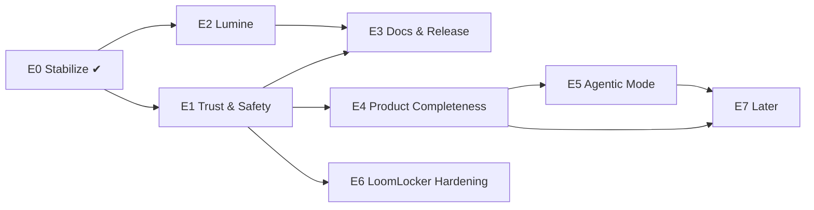

# PromptLoom — Work Tracker

The single source of truth for what is done, what is next, and what blocks what.
Keep it current: update a ticket's status in the same commit that does the work.

**Last updated:** 2026-09-21 · **Current version:** 4.2.0 · **Active epic:** E1 — Trust & Safety

---

## How to use this file

**Status:** `TODO` · `IN PROGRESS` · `BLOCKED` · `DONE` · `DROPPED`
**Priority:** `P0` blocker for a public release · `P1` important · `P2` nice to have
**Size:** `S` ≤ half a day · `M` 1–2 days · `L` 3–5 days · `XL` > 1 week

Each ticket: `ID · title · status · priority · size · depends on`. A ticket may start only when everything in **Depends** is `DONE`.
Completed tickets stay in the file (with the commit or date) so history is visible. Add new tickets at the bottom of the right epic with the next free ID.

---

## Board (at a glance)

| Epic | Goal | Progress |
|---|---|---|
| **E0** Stabilize | Green tests, clean repo, CI, license | 8 / 8 done |
| **E1** Trust & Safety | Secure registry, tested core, working install path | 0 / 8 |
| **E2** Lumine (VS Code) | v2-only DSL support, tested, published | 0 / 5 |
| **E3** Docs & Release | Accurate docs, release binaries, packaging | 0 / 6 |
| **E4** Product Completeness | impact, sync, eval | 0 / 5 |
| **E5** Agentic Mode | run / refine / decide / quest, `.lmscr` | 0 / 5 |
| **E6** LoomLocker Hardening | Tests, Windows, libraries verified end-to-end | 0 / 5 |
| **E7** Later (V4 remainder, V5, V6) | RAG, dashboard, governance, team server | 0 / 6 |

### Dependency map

---

## E0 — Stabilize ✔

| ID | Ticket | Status | Pri | Size | Depends |
|---|---|---|---|---|---|
| PL-001 | Rewrite stale `internal/tui` deploy tests in v2 syntax (`.prompt.loom`, `:=`, `from()`) | DONE | P0 | S | — |
| PL-002 | Untrack build/OS/local files: `loom` binary, `.DS_Store`, `libs/loomj/target`, `LoomTest/` | DONE | P0 | S | — |
| PL-003 | Add MIT `LICENSE` at repo root | DONE | P0 | S | — |
| PL-004 | GitHub Actions CI: build + vet + test for root, `server`, `loomlocker`, `libs/gloom`; build Lumine | DONE | P0 | S | PL-001 |
| PL-005 | Version injected at build time (`-ldflags`), `Makefile` with `build/test/vet/check` | DONE | P1 | S | — |
| PL-006 | Prune docs to a minimum set; add this tracker | DONE | P1 | S | — |
| PL-007 | Fix README links to removed docs | DONE | P1 | S | PL-006 |
| PL-008 | Ignore local-only planning notes (`CLAUDE.md`, old specs) | DONE | P2 | S | — |

---

## E1 — Trust & Safety  *(start here)*

Goal: a stranger can `loom install` and `loom publish` against a registry safely, and the core has real test coverage.

| ID | Ticket | Status | Pri | Size | Depends |
|---|---|---|---|---|---|
| PL-101 | **Registry auth**: fail closed when `UPLOAD_SECRET` is unset; use `subtle.ConstantTimeCompare` (not `EqualFold`); apply to `DELETE` as well as `POST` | TODO | P0 | S | PL-004 |
| PL-102 | Registry hardening: request body size limit, per-IP rate limit, validate slug/version/file paths (no `..`), tighten CORS default from `*` | TODO | P0 | M | PL-101 |
| PL-103 | Registry tests: handlers + store (use a test Postgres or an interface fake) | TODO | P0 | M | PL-101 |
| PL-104 | **Decide registry hosting** (self-host only vs. hosted). Replace hard-coded default `https://registry.promptloom.dev` or ship a clear "no registry configured" error with setup steps | TODO | P0 | S | — |
| PL-105 | Dockerfile + `docker-compose.yml` (server + Postgres) and deploy notes | TODO | P1 | M | PL-102, PL-104 |
| PL-106 | End-to-end tests over `testdata/valid` and `testdata/invalid` (currently empty): every validation rule has a passing and a failing fixture | TODO | P0 | L | PL-004 |
| PL-107 | Unit tests for `loader`, `lock`, `installer` (conflict + lock paths), `deps` edge cases, `contract`, `audit`, `doctor` | TODO | P1 | L | PL-106 |
| PL-108 | Migration path for old syntax: friendly, specific error when a file uses `+=`, `-=`, bare `:` or `extends`, pointing at the `:=` / `from()` fix (a `loom migrate` command was dropped as a design decision — re-open only if needed) | TODO | P1 | M | PL-106 |

**Exit criteria for E1:** `go test ./...` covers the parser→render path and every validation rule; registry refuses unauthenticated writes; `loom install` works against a documented registry.

---

## E2 — Lumine (VS Code extension)

| ID | Ticket | Status | Pri | Size | Depends |
|---|---|---|---|---|---|
| PL-201 | Make Lumine **v2-only**: accept `:=` only; report `+=`, `-=`, bare `:` and `extends` with a quick-fix message; update grammar, completions, hover, formatter | TODO | P0 | M | PL-108 |
| PL-202 | Add `from()` / `parent[...]` awareness: syntax highlighting, completions, type errors (scalar vs list) matching `loom inspect` | TODO | P1 | M | PL-201 |
| PL-203 | Test suite for the TypeScript parser, validator, and formatter (golden files shared with the Go `testdata`) | TODO | P1 | L | PL-201, PL-106 |
| PL-204 | Update `Lumine/README.md` and `CHANGELOG.md`; bump to 0.2.0 | TODO | P1 | S | PL-201 |
| PL-205 | Publish to the VS Code Marketplace / Open VSX (publisher account, icon, `vsce package` in CI) | TODO | P2 | M | PL-203, PL-204 |

---

## E3 — Docs & Release

| ID | Ticket | Status | Pri | Size | Depends |
|---|---|---|---|---|---|
| PL-301 | Audit `docs/LOOM_COMMAND.md` and `docs/LOOM_LANGUAGE.md` against the code: every command and flag exists; every example runs | TODO | P1 | M | PL-106 |
| PL-302 | Add missing commands to `LOOM_COMMAND.md` (`install` dependency behaviour, `execute`, any added since) and remove references to removed ones | TODO | P1 | S | PL-301 |
| PL-303 | GoReleaser (or equivalent): tagged release builds for macOS/Linux/Windows, checksums, GitHub Release notes | TODO | P0 | M | PL-004, PL-305 |
| PL-304 | Homebrew tap and Scoop manifest; `go install` instructions verified | TODO | P2 | M | PL-303 |
| PL-305 | Windows support: replace `syscall.Stdin` with `os.Stdin.Fd()` in `internal/cli/execute.go` and `loomlocker/cli/root.go`; add a Windows job to CI | TODO | P1 | M | PL-004 |
| PL-306 | Shell completions (`loom completion bash\|zsh\|fish\|powershell`) and `loom doctor` self-check of the install | TODO | P2 | S | — |

---

## E4 — Product Completeness

Builds on existing packages (`internal/graph`, `internal/testrunner`, `internal/render`, `deploy`).

| ID | Ticket | Status | Pri | Size | Depends |
|---|---|---|---|---|---|
| PL-401 | `loom graph <PromptName>`: per-prompt inheritance diagram (ancestors, descendants, blocks used) as text + Mermaid | TODO | P1 | S | PL-106 |
| PL-402 | `loom impact <Name>`: blast radius — direct and transitive dependents from the existing graph | TODO | P1 | S | PL-401 |
| PL-403 | `loom sync` / `check-sync`: render to Claude, Copilot, Cursor and `AGENTS.md` targets from `[[targets]]`; hash-compare for drift | TODO | P1 | M | PL-106 |
| PL-404 | `loom eval`: `.eval.toml` fixtures, LLM-judge scoring (0–100), `--record` / `--compare`, `--models`; gate in `loom ci` | TODO | P1 | XL | PL-107 |
| PL-405 | Provider abstraction for LLM calls (Gemini + Anthropic + OpenAI-compatible) shared by `test`, `start`, `summarize`, `eval` | TODO | P1 | M | PL-107 |

---

## E5 — Agentic Mode

The stated next phase after v4.2.0. Needs a provider layer and a stable core first.

| ID | Ticket | Status | Pri | Size | Depends |
|---|---|---|---|---|---|
| PL-501 | Design doc: agent runtime scope (streaming, tool use, multi-turn, safety model, how it interacts with LoomLocker and `permission` in `.loom.config`) | TODO | P1 | M | PL-405 |
| PL-502 | `loom run <Name>`: execute a resolved prompt against a model with streaming output | TODO | P1 | L | PL-501 |
| PL-503 | Refine / decide loop (`loom optimize`, `loom score`, `--refine`) | TODO | P2 | L | PL-502, PL-404 |
| PL-504 | Quest mode (multi-step guided task on top of `loom run`) | TODO | P2 | L | PL-502 |
| PL-505 | `.lmscr` loom scripts: syntax, runner, docs | TODO | P2 | XL | PL-501 |

---

## E6 — LoomLocker Hardening

| ID | Ticket | Status | Pri | Size | Depends |
|---|---|---|---|---|---|
| PL-601 | Tests for `crypto` (bcrypt, Argon2id, AES-GCM round trip), `locker/files` (env + YAML lock/unlock fidelity), `server` (auth, auto-relock timer) | TODO | P0 | L | PL-004 |
| PL-602 | Bind server to `127.0.0.1` only; confirm no unauthenticated unlock path; document threat model | TODO | P0 | S | PL-601 |
| PL-603 | Integration test: `loomlocker start` + `loom execute --unlock` + each client library (bloompy, gloom, loomj) | TODO | P1 | L | PL-601 |
| PL-604 | Crash safety: atomic file writes, lock journal so a crash while locked is recoverable | TODO | P1 | M | PL-601 |
| PL-605 | Add JSON secret paths (`.json:{key}`), a `loomlocker` README, publish libraries (PyPI, Maven Central) | TODO | P2 | L | PL-603 |

---

## E7 — Later

Only start after E1 and E4 are done.

| ID | Ticket | Status | Pri | Size | Depends |
|---|---|---|---|---|---|
| PL-701 | `loom index` + `--auto-context` (RAG over project files) | TODO | P2 | XL | PL-405 |
| PL-702 | `loom serve` web dashboard | TODO | P2 | XL | PL-402 |
| PL-703 | `loom policy check`, `owner` / `status` / `deprecated` DSL fields, `loom owners` | TODO | P2 | L | PL-403 |
| PL-704 | `loom bench`, `loom usage` (token and cost tracking) | TODO | P2 | L | PL-404 |
| PL-705 | Pack signing and trust (`pack sign / verify / trust`) | TODO | P2 | L | PL-102 |
| PL-706 | Team server, approval workflows, private registry with RBAC/SSO, audit log | TODO | P2 | XL | PL-703, PL-705 |

---

## Recommended sequence

1. **PL-101 → PL-102 → PL-103** — secure the registry (security blocker).
2. **PL-104** — decide where the registry lives (can run in parallel).
3. **PL-106 → PL-107 → PL-108** — test net, then friendly old-syntax errors.
4. **PL-201 → PL-203** — bring Lumine in line with the language.
5. **PL-303 + PL-305** — first tagged release.
6. **E4** (`graph` / `impact` / `sync` first, `eval` last), then **E5**.

---

## Decisions log

| Date | Decision |
|---|---|
| 2026-05 | `+=` and `-=` removed; `:=` is the only operator; multiple inheritance uses `from()` |
| 2026-05 | `loom migrate` cancelled — new packs use v2 from the start; old examples live in `examples/legacy/` |
| 2026-09-21 | One tracker file (this one) replaces the scattered planning notes; language and command docs remain in `docs/` |
| 2026-09-21 | `docs/TOOL_REFERENCE.md` and `docs/PACKMAKER_DESIGN.md` removed from git as stale/contradictory; `docs/LOOM_COMMAND.md` and `docs/LOOM_LANGUAGE.md` are canonical |

## Known risks

- Registry URL default points at a host that may not exist (PL-104).
- Core packages are mostly untested (PL-106, PL-107); refactors are risky until they are.
- Lumine and the Go parser can drift apart (PL-203 addresses this with shared fixtures).
